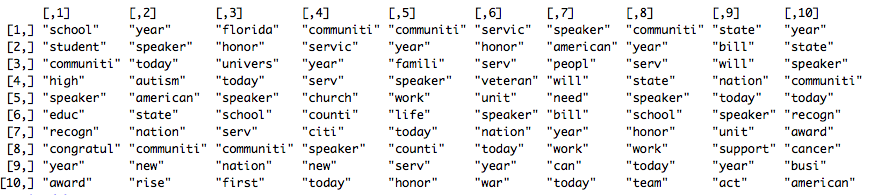
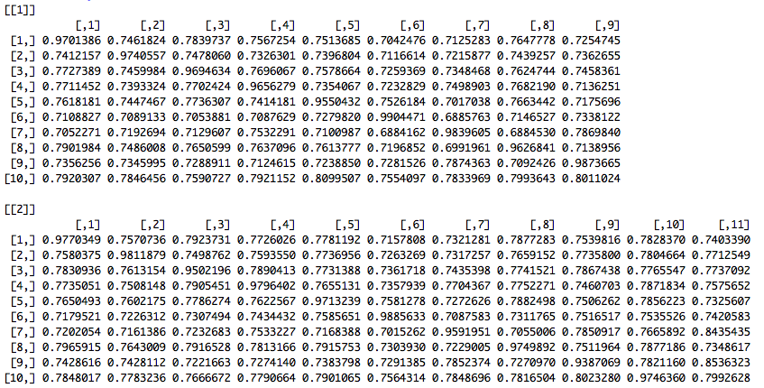
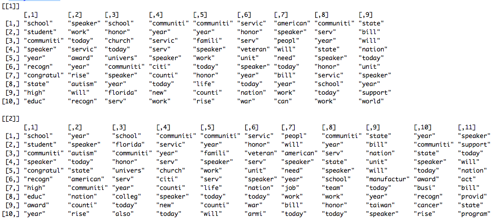

# ldaRobust
This is a package to assess LDA topic instability and robustness


## How to install

Eventually the package will be on CRAN... but for now, use the following instructions to install it in your local machine.

1. Download or Clone a copy of this `ldaRobust` repository-directory.
Click on the green `Clone or download` button on the upper right corner of the page to get the cloning link or to download a zipped version of the repository.

2. Make sure you have the following dependencies installed: `devtools` and `SnowballC`
If you don't, you will have to install them in `R` by typing:
```
install.packages("devtools")
install.packages("SnowballC")
```

2. Make sure to change the following directory to the parent directory of the ldaRobust folder on your machine.
For example, I have the `ldaRobust` directory in a `repos` directory in my Desktop. So in order to install the package I do:
```
dir <- "/Users/andreucasas/Desktop/repos/"
setwd(dir)
devtools::install("ldaRobust")
```

## Short Example

1. Load data (a sample of Congressional one-minute floor speeches from the 113th Congress)
```
setwd("./ldaRobust")
data <- rjson::fromJSON(file = "data.json")
```

2. Select a random sample of only 1,000 floor speeches to speed up computation in this example
```
set.seed(123) # - we set the seed so we can get reproducible results
data <- data[sample(x = 1:length(data), size = 1000, replace = FALSE)]
```

3. Transform the documents in this sample dataset to a Document Term Matrix. We use the `tm` package for the DTM conversion.
```
df<- plyr::ldply(data, data.frame)
x = tm::SimpleCorpus(tm::VectorSource(df$speech), control=list(language ="en"))
dtm = tm::DocumentTermMatrix(x, control=list(language="en",removePunctuation=TRUE, stopwords=TRUE, removeNumbers=TRUE,stemming=TRUE, tolower=TRUE))
```

4. Run a first original LDA model with 10 topics.
```
lda = topicmodels::LDA(dtm, 10)
```

Run the following code to take a look at the 10 most predictive features of each topic.
```
library(dplyr) # - install dplyr if you don't have it
original_lda_predictive_features <- sapply(1:nrow(lda@beta), function(i)
  as.character((data.frame(pr = lda@beta[i,], feature = lda@terms) %>% 
  dplyr::arrange(desc(pr)) %>%
  head(n = 10))$feature))
print(original_lda_predictive_features)
```
You should see the following output with the most predictive keywords of each topic.


5. Create `rlda` object that will contain all the information we will generate. We are specifying the following parameters:
  - `dtm` = your Document Term Document matrix.
  - `lda_u`= your original LDA model. We will asses how robust this model is to different model specifications.
  - `threshold` = (numeric) a similarity threshold (range {0,1} where 1 the maximum similarity). We will use it to determine whether two topics are the same.
  - `K` = the number of models (numeric) or a list of topic numbers (list) of other models to which you want to compare your original LDA. If you provide a numeric value, e.g. 2, we will compare your original model with 10 topics to a 9 and a 11 topic model. If you provide a list, e.g. [5,15,25], we will compare your original model with 10 topics to a 5, 15, and 25 topic model.
  - `compute_parallel` = a bool value to indicate whether you want the models to be trained in fit function to be trained in parallel. 
  - `num_of_clusters` = the number of clusters (numeric) or a list of cluster numbers (list) to which you want to compare your original LDA. If the original model has topic number 10 and you provide a numeric value, e.g. 2, we will cluster topics in all models into 9, 10 and 11 clusters. If you provide a list, e.g. [5,15,25], we will cluster all topics into 5, 15, 25 clusters.
  
In this example we specify `K = 2` and `threshold = 0.8`. (Please make sure that the ldaRobust library is appended; otherwise, cannot create new objects.) 
```
r <- new("rlda", 
         dtm=dtm, 
         lda_u=lda, 
         threshold = 0.8, 
         similarity_measure = "cosine", 
         K = 2,
         compute_parallel = True,
         num_of_clusters = 3)
```

6. Fit the new LDA models. We are taking the `K` parameter specified in the previous step to see what other LDA models we want to fit to the data. In this example a 9 and a 11 topic model.
```
r <- ldaRobust::fit(r)
```

7. Compute the topic similarity between all topics in the original model (10 topics in this example) and all the topics in the other models (9 and 11 topic models in this example). As specified in step 5, we will use `cosine` similarity (`hellinger` similarity can also be used). This function helps us evaluate if we would find a very similar topic if we were to slightly change the number of topics.
```
r <- ldaRobust::comput_sim(r)
```
You can take a look at the cosine similarities by typing `r@similarity_mat_list`. The output is a list where each list element is a similarity matrix comparing the topics of the original model with the topics of a new model. In these similarity matrices, each row presents a topic from the original topic and each column a topic of a new model. You should get an outcome similar to this one. We can see for example that Topic 1 from the original 10-topic model is very similar to Topic 1 in both 9-topic and 11-topic models. 



You can also type `r@key_features` to check the most predictive features of each topic in the alternative models.



8. To check whether the alternative models would generate similar results, for each alternative model you can evaluate whether the proportion of documents that have a given topic from the original model as a max class also have as max class topics from the alternative model that map to that original topic. Also, you can evluate the proportion of documents that are dominated by a topic maps to a given topic in the original model. We use the similarity `threshold` provided in step 5 to map topics form the alternative models to topics from the original model.
```
r <- ldaRobust::getTopicInDoc(r)
```
To evaluate the first proportion, type `r@topic_dom_perc_list`. This will return a list where each list element is a vector of proportion of documents mapped to the same topic in the original and comparison models. The ith value in the jth vector is the proportion of documents mapped to the same ith topic in the original and comparison model j. 

To evaluate the second proportion, type `r@model_topic_mat`, This will return a list where each list element is a vector of proportions of documents that are dominated by a topic map to a given topic in the original model. The ith value in the jth vector is the proportion of documents mapped to the ith original model topic in the jth comparison model.

9. Cluster topics across models into overarching topic groups. The following function perform spectral clustering on the topics across the original model and the comparison models using number of centers provided in the num_of_clusters option in the rlda object. It will return a list of vectors that contain the cluster assignment of each topic in each model, a list of matrix contains top 10 keywords in each cluster, a list of matrix contains the cluster assignment of each document(based on the cluster assignment of the dominant topic of that document) in each model, a list of list contains percentage of documents belong to a given cluster in a given model for each number of clusters.

```
r <- ldaRobust::cluster_topic(r)
```

The cluster assignment of each topic can be found by typing ```r@topic_cluster_assignment```. It will return a list where each list element is a vector that contains cluster assignment of each topic with the order of [topics in the original model, topic in the comparison models ordered same as in r@K after fit] for each cluster number. 

The keywords for each cluster can be found by typing ```r@cluster_center_key_words_list```. It will return a list where each list element is a matrix that each column contains top 10 keywords of the center of the corresponding cluster for each cluster number. 

```r@dominant_topic_cluster_list``` gives a list where each list element is a matrix that contains the cluster assignment of each document for all models for each cluster number. The i,jth term in a matrix in the list gives the cluster assignment for document j in the ith model, where the models are ordered as [the original model, the comparison models ordered same as in r@K after fit].

```r@perc_document_belong_cluster_list``` gives a list where each list element is a list of vectors that contains percentage of documents belong to a cluster in each model for each cluster number. The ith vector in jth list contains percentage of documents belongs to each cluster in the ith model when used cluster number j in ```r@num_of_clusters```. Models are ordered as [the original model, the comparison models ordered same as in r@K after fit].


10. To obtain visualizations of results obtained using the ```ldaRobust::comput_sim``` and  ```ldaRobust::getTopicInDoc```, use the following function.

```
ldaRobust::plot_visual(r, dir)
```

```dir``` is a string that contains the path where you want the generated plots to be saved in. It should not end with "/" in the end. e.g. ```dir <- "~/Desktop"```. The generated the similarity matrix plots for each model will be saved in ```dir/sim```, and the plot for two matrices in ```ldaRobust::getTopicInDoc``` will be saved in ```dir/topDoc```. 

